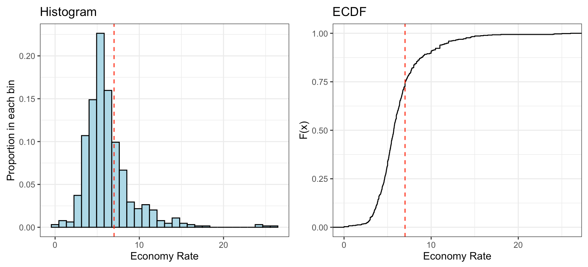
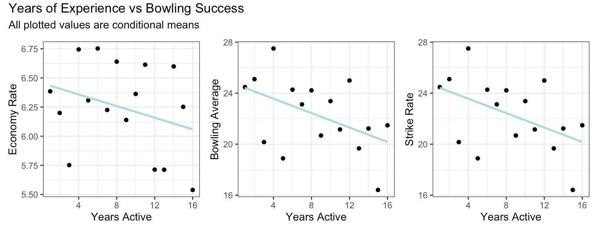

## Basic Gameplay

- Team Sport with 2 teams and 11 players each

--

- 1 team bats in an innings and the opposing team bowls and fields

--

- __Goal of batting__ : more runs without getting out
- __Goal of bowling__ : less runs and more wickets

--

- The team with the most runs wins

.pull-right[
.center[]
]

---

##T20 Cricket
- 1 Over = 6 balls

--

- The number of overs in an innings depends on the type of cricket played

--

- In T20, there are upto 20 overs per innings and an innings for each team to bat in

---

## Overview of the data
### Where it comes from

--

- Scraped from [ESPN cricinfo](https://www.espncricinfo.com) using the [cricketdata](https://docs.ropensci.org/cricketdata/) package.

--

- The dataset contains the career numbers of all active players during the 2019 and 2020 Women's International T20 season (n = 989).

--

  - The vast majority (just under 86%) of the players in the data have 3 or fewer years of international experience. But the remaining players are true veterans of the game, with a mean of 9.2 years of experience.
  
--

  - This can make the dataset challenging to work with.

---
## Overview of the data
### The variables

--

- player - player name
- country - player nationality
- start - players first season
- end - players most recent season. All players last played in either 2019 or 2020
- matches - matches played
- innings - total innings bowled
- overs - the number of overs bowled. An over consists of six consecutive balls bowled
- maidens - the number of maiden overs, which is an over in which the bowler conceded zero runs
- runs - the number of runs conceded
- wickets - the number of wickets taken
- __ average - the average number of runs conceded per wicket taken__
- __ economy - the average number of runs conceded per over__
- __ strike_rate - the average number of balls bowled per wicket taken.__

---
## Overview of the data
### Cleaning the data

--

1) Fixed parsing errors
- Example: SLE -> "Sierra Leone" instead of SLE -> "Sri LankaE"

--

2) Removed player with caps for multiple countries

--

3) Created three new variables

- maiden_ratio - the proportions of overs that are maiden overs
- usage_rate - overs bowled per innings
- career_length - players most recent year minus their debut year plus one.

---
## Exploring the data

- For T20 matches, an economy under seven is generally considered [good.](https://web.archive.org/web/20150906074338/http://cricket.about.com/od/glossary/fl/Economy-rate.htm).

--

- __Hypothesis__: Having an economy rate below seven is a good indicator of bowling talent.

--

.center[]

--

```{r, echo = F, message=F, warning=F}
source("clean_data.R")
quantile(cricket_cleaned$economy, na.rm = T)
```

---
## Exploring the data

- We would expect players with more experience to perform better. Does the evidence bear this out?

--

- __Hypothesis:__ Players with more experience in T20 cricket will show more bowling success

--

.center[]


---
## Exploring the data

- Countries in the Indian subcontinent are very competitive when it comes to cricket.

--

- __Hypothesis:__ Sri Lanka has the most bowling potential in region.

--

- To test this hypothesis, we decided to compare the following 4 countries:
  - India
  - Pakistan
  - Bangladesh
  - Sri Lanka

---
## Exploring the data

- We computed the mean value of the following statistics for players from each country: Bowling Average, Strike Rate, Maiden Ratio, and Economy Rate. Based on this visualization, we have evidence to reject the hypothesis.


```{r out.width='55%', echo = FALSE, fig.align='center'}
stat.labs <-c("Mean average", "Mean Economy", "Mean Maiden Ratio", "Mean Strike Rate")
names(stat.labs) <- c("avg_average", "avg_economy", "avg_maidenratio", "avg_strikerate")
cricket_cleaned %>%
  filter (strike_rate != Inf | average != Inf) %>%
  filter (country %in% c("India", "Bangladesh", "Sri Lanka", "Pakistan")) %>%
  group_by(country) %>%
  summarise(avg_economy = sum(economy)/ n(), 
            avg_strikerate = sum(strike_rate)/n(),
            avg_maidenratio = sum(maiden_ratio)/n(),
            avg_average = sum(average)/n()) %>%
  pivot_longer(avg_economy:avg_average,
               names_to= "stat",
               values_to = "value") %>%
  ggplot() +
  geom_col(aes(x = country, y = value, fill = stat)) +
  facet_wrap(~stat, ncol=2, scales = "free_y", labeller= labeller(stat = stat.labs))+
  ggthemes::scale_fill_colorblind() +
  theme_bw() +
  labs(x = "Country", y = "Values",
       title = "Which team in the Indian Subcontinent has the best bowlers?") +
  theme(strip.background = element_blank(),
        legend.position = "none")
```

---
## Clustering

- We grouped the data set by country and computed the group mean for innings, overs, career length, runs, wickets, and maidens.

--

- We scaled the variables and performed hierarchial clustering using complete linkage.

--

```{r out.width='52%', echo = FALSE, fig.align='center'}
cricket_by_country <- cricket_cleaned %>%
  na.omit() %>% 
  group_by(country) %>%
  summarise(avg_yearsactive = sum(years_active)/n(),
            avg_innings = sum(innings)/n(),
            avg_overs = sum(overs)/n(),
            avg_runs = sum(runs)/n(),
            avg_wickets = sum(wickets)/n(),
            avg_maidens = sum(maidens)/n())

country_names <- cricket_by_country$country
cricket_by_country_scaled <- cricket_by_country %>% 
  dplyr::select(-c("country")) %>%
  scale() %>% 
  as.data.frame() 
clust_by_country <- hclust(dist(cricket_by_country_scaled),
                           method = "complete")
clust_by_country$labels <- country_names
clust_by_country %>% 
  as.dendrogram() %>% 
  factoextra::fviz_dend(k = 3, cex = 0.6, horiz = T, rect = T) +
  labs(title = "Hierarchical clustering",
       subtitle = "Using complete linkage with 3 clusters")
```

---
##Clustering
- The scatterplot below shows the clusters more clearly
```{r out.width='70%', out.height='70%', echo = FALSE, fig.align='center', warning = F}
three_clusters <-cutree(clust_by_country, k=3)
cricket_by_country %>%
  mutate(cluster = as.factor(three_clusters)) %>%
  ggplot() +
  geom_point(aes(x = avg_runs, y = avg_wickets, color = cluster)) +
  theme_bw() +
  xlab("Average Wickets") +
  ylab("Average Runs")
```

---

- It appears to be clustered primarily based on average career lengths

--

- This summary table also highlights these large difference in average values between the clusters

```{r}
cricket_by_country %>%
  mutate(cluster = cutree(clust_by_country, 3)) %>% 
  select(-c("country")) %>%
  group_by(cluster) %>% 
  mutate(num = n(),
         avg = avg_runs/avg_wickets,
         economy = avg_runs/avg_overs,
         strike_rate = (avg_overs*6)/avg_wickets) %>% 
  summarise_all(mean) %>% 
  select(num, avg, economy, strike_rate)
```
